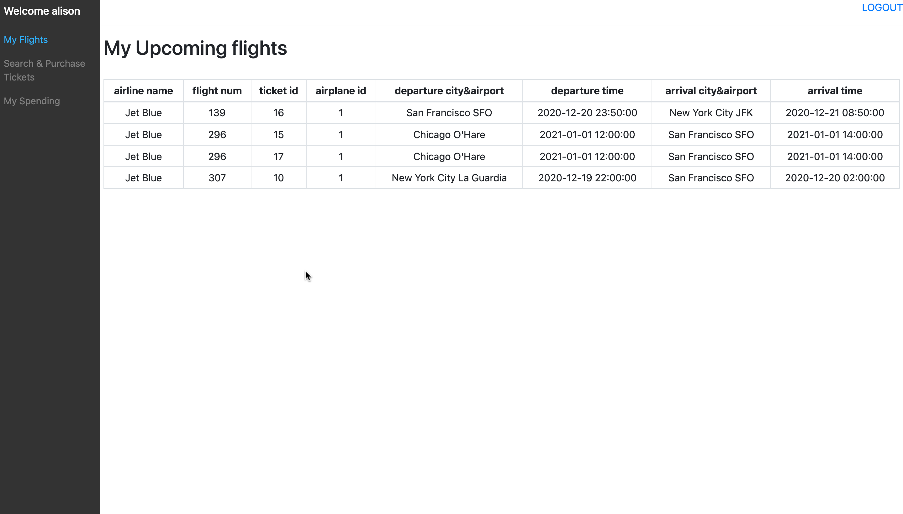
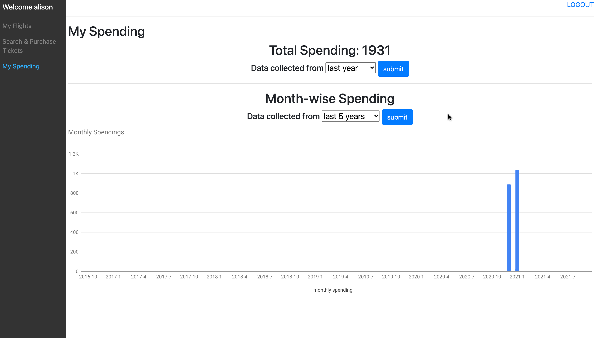

# Databases-final-project

CSCI-SHU 213 Databases | Fall2020 | Final project

"The **objective** of this course project is to provide a realistic experience in the design process of a relational database and corresponding applications. We will focus on conceptual design, logical design, implementation, operation, maintenance of a relational database. We will also implement an associated web based application to communicate with the database (retrieve information, store information etc)."

The project consists of three homeworks throughout the semester.

## Part1 (Oct.11)

Design RE diagram.

## Part2 (Nov.8)

Design relational diagram.

Create database & insert dummy data according to the relational diagram.

## Part3 **By Alison Yuhan Yao & Xue Bai** (Dec. 10)

Please check out `flask/Flask_for_class`. It builds a basic app where you can serve a webapp through flask and pass data/variables between frontend and backend.

Once you have a basic working webapp that you can see, it is time to move on to the security and optimization of the databases. After all, it is a databases class and there is no need to fixate on the frontend design too much. Though the frontend should be easy on the eye and usable.

